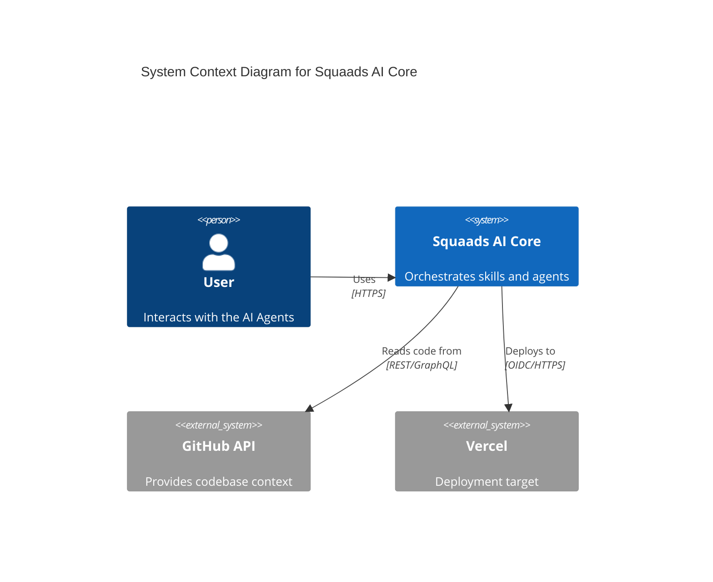
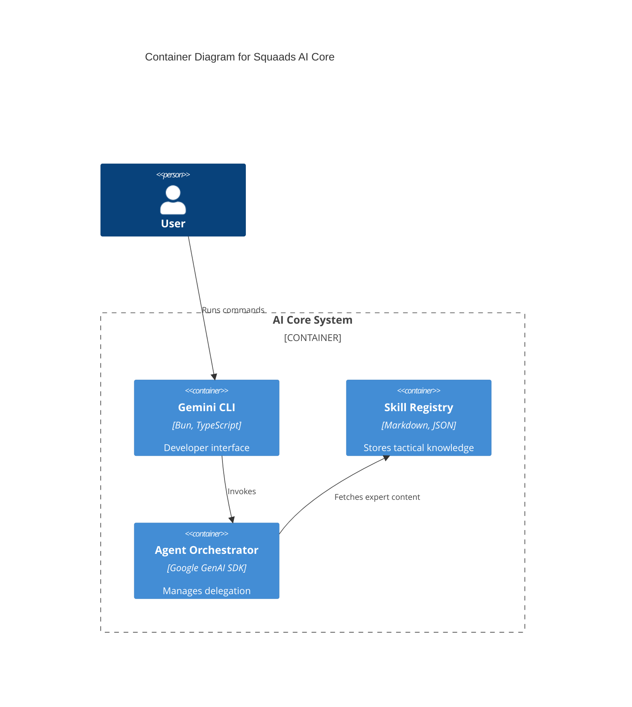

# 🏗️ Skill: c4-architect (v1.0.0)

## Executive Summary
Senior Software Architect for 2026. Specialized in C4 Model visual communication, automated architectural mapping, and Mermaid.js orchestration. Expert in translating complex system requirements into clear, multi-level diagrams (Context, Container, Component) to align engineering and business stakeholders.

---

## 📋 The Conductor's Protocol

1.  **Level Selection**: Determine the required level of abstraction (L1 Context, L2 Container, or L3 Component) based on the target audience.
2.  **State Mapping**: Use `codebase_investigator` to extract the current system structure (apps, services, databases).
3.  **Sequential Activation**:
    `activate_skill(name="c4-architect")` → `activate_skill(name="mermaid-diagram-pro")` → `activate_skill(name="docs-pro")`.
4.  **Verification**: Render the Mermaid code and verify that all relationships accurately reflect the current technical state.

---

## 🛠️ Mandatory Protocols (2026 Standards)

### 1. Level-Specific Documentation
As of 2026, C4 diagrams must be treated as "Living Documentation."
- **L1 (System Context)**: Always start here. Define the system boundary and its external actors (Users, 3rd party APIs).
- **L2 (Container)**: Decompose the system into deployable units (Next.js apps, NestJS services, PostgreSQL, NATS).
- **L3 (Component)**: Only create for high-complexity containers (e.g., the core Auth or Payment service).

### 2. Mermaid C4-Standard Syntax
- **Rule**: Use the official `C4Context`, `C4Container`, and `C4Component` types in Mermaid.
- **Protocol**: Always include a `title` and a `Legend` in every diagram.

### 3. Diagram-as-Code (DaC)
- **Rule**: Never use static image files. Store diagrams as `.mermaid` files or embedded markdown blocks.
- **Protocol**: Link diagram elements to the relevant source code directories using comments or metadata.

---

## 🚀 Show, Don't Just Tell (Implementation Patterns)

### Level 1: System Context Diagram (L1)

### Level 2: Container Diagram (L2)

---

## 🛡️ The Do Not List (Anti-Patterns)

1.  **DO NOT** create Level 4 (Code) diagrams manually. They go stale instantly. Use automated tools if needed.
2.  **DO NOT** mix levels of abstraction. Don't show a specific React component next to a Person in an L1 diagram.
3.  **DO NOT** leave relationship arrows unlabeled. "Uses" is better than nothing, but "Authenticates via JWT" is elite.
4.  **DO NOT** ignore the Legend. Colors and shapes must be explained.
5.  **DO NOT** over-complicate. If a diagram has more than 15 elements, it should probably be split.

---

## 📂 Progressive Disclosure (Deep Dives)

- **[C4 Syntax Reference](./references/c4-syntax.md)**: Cheat sheet for Mermaid C4 commands.
- **[Architectural Mapping Workflow](./references/mapping-workflow.md)**: Moving from code discovery to L2 diagrams.
- **[Diagrams in PRs](./references/pr-integration.md)**: Automated diagram generation during code reviews.

---

## 🛠️ Specialized Tools & Scripts

- `scripts/extract-l2-containers.ts`: Scans a monorepo's `package.json` files to generate an initial L2 Mermaid diagram.
- `scripts/lint-mermaid.sh`: Validates Mermaid syntax and C4 standards.

---

## 🎓 Learning Resources
- [The C4 Model Official Website](https://c4model.com/)
- [Mermaid.js C4 Diagram Docs](https://mermaid.js.org/syntax/c4.html)
- [Architecture as Code 2026](https://example.com/aac)

---
*Updated: January 23, 2026 - 19:30*
