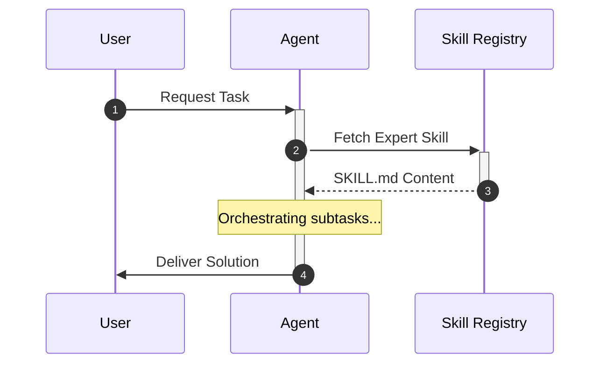
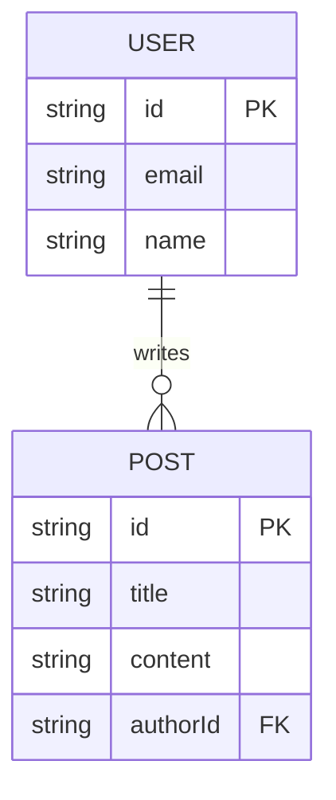
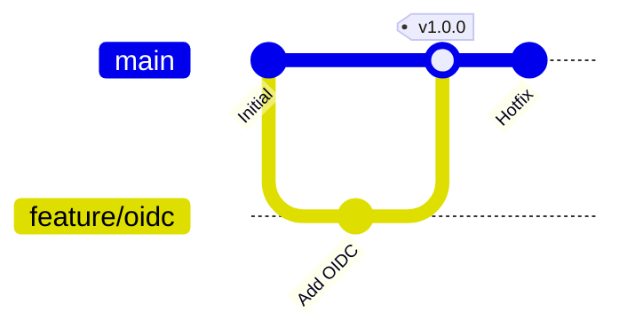

# 📊 Skill: mermaid-diagram-pro (v1.0.0)

## Executive Summary
Senior Visualization Architect & Documentation Engineer for 2026. Specialized in Mermaid.js orchestration, Diagram-as-Code (DaC) workflows, and automated system behavior modeling. Expert in generating high-fidelity Sequence, ERD, Gitgraph, and State diagrams to visualize complex logic, data flows, and project timelines within the Gemini Elite Core.

---

## 📋 The Conductor's Protocol

1.  **Visual Logic Mapping**: Determine which diagram type best represents the information (Flowchart for logic, Sequence for interactions, ERD for data, Gitgraph for workflows).
2.  **Context Extraction**: Gather the necessary technical details (symbols, state transitions, relationship cardinality) from the codebase.
3.  **Sequential Activation**:
    `activate_skill(name="mermaid-diagram-pro")` → `activate_skill(name="docs-pro")` → `activate_skill(name="c4-architect")`.
4.  **Verification**: Render the Mermaid code and check for logical consistency and visual clarity.

---

## 🛠️ Mandatory Protocols (2026 Standards)

### 1. Diagram-as-Code (DaC) Integrity
As of 2026, diagrams must live in version control.
- **Rule**: Never use static images for technical documentation. Always use raw Mermaid syntax in Markdown.
- **Protocol**: Store complex, reusable diagrams in `.mermaid` files in the `assets/` directory.

### 2. High-Fidelity Sequence Modeling
- **Rule**: Use `autonumber`, `activate/deactivate`, and `Note` to make interactions explicit.
- **Protocol**: Map every message in a sequence diagram to a specific function call or network request in the code.

### 3. Precise Entity-Relationship Modeling (ERD)
- **Rule**: Use Crow's Foot notation for relationships. Always include data types and PK/FK indicators.
- **Protocol**: Derive ERDs directly from Prisma/Drizzle schemas when possible to ensure zero drift.

### 4. Gitflow & Workflow Visualization
- **Rule**: Use Gitgraph for all PR descriptions involving complex branching or rebasing logic.
- **Protocol**: Standardize on `main`, `develop`, and `feature/*` branch naming in examples.

---

## 🚀 Show, Don't Just Tell (Implementation Patterns)

### Advanced Sequence Diagram (Interaction Logic)

### Entity-Relationship Diagram (Database Schema)

### Gitgraph (Branching Strategy)

---

## 🛡️ The Do Not List (Anti-Patterns)

1.  **DO NOT** create diagrams with more than 20 nodes without grouping or subgraphs.
2.  **DO NOT** use default colors for critical paths. Use custom styles to highlight them.
3.  **DO NOT** write Mermaid syntax that generates "crossing lines" in flowcharts if avoidable (use `LR` vs `TD`).
4.  **DO NOT** ignore accessibility. Provide a text-based summary of the diagram's meaning for screen readers.
5.  **DO NOT** leave participants in sequence diagrams as generic names like `Agent1`. Use their specific expert titles.

---

## 📂 Progressive Disclosure (Deep Dives)

- **[Advanced Sequence Patterns](./references/sequence-patterns.md)**: Loops, Alt, and Parallel interactions.
- **[ERD Best Practices](./references/erd-best-practices.md)**: Modeling complex relations and data types.
- **[Gitgraph for DevOps](./references/gitgraph-devops.md)**: Visualizing release cycles and CI/CD flows.
- **[Styling & Themes](./references/styling-themes.md)**: Customizing colors, fonts, and layout engines.

---

## 🛠️ Specialized Tools & Scripts

- `scripts/verify-mermaid.sh`: Lints Mermaid syntax and checks for broken links.
- `scripts/schema-to-erd.ts`: Generates a Mermaid ERD from a Prisma schema.

---

## 🎓 Learning Resources
- [Mermaid.js Official Documentation](https://mermaid.js.org/)
- [Diagramming as Code in 2026](https://example.com/dac-2026)
- [Visualizing Software Architecture](https://example.com/viz-arch)

---
*Updated: January 23, 2026 - 20:05*
